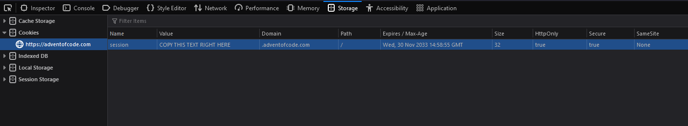

# New-Advent

This is a basic project that will automatically scaffold a rust advent of code project

## Usage

- Fill in .session.cookie.example
    - Should look like session=546eg45g
- Get your session cookie by
    - going to <https://adventofcode.com/>
    - open developer tools (CTRL+SHIFT+I)
    - Storage tab
    - Cookies
    - then the value under session
    - 
- Compile the program (cargo build --release)
- Run the program and follow the given steps
